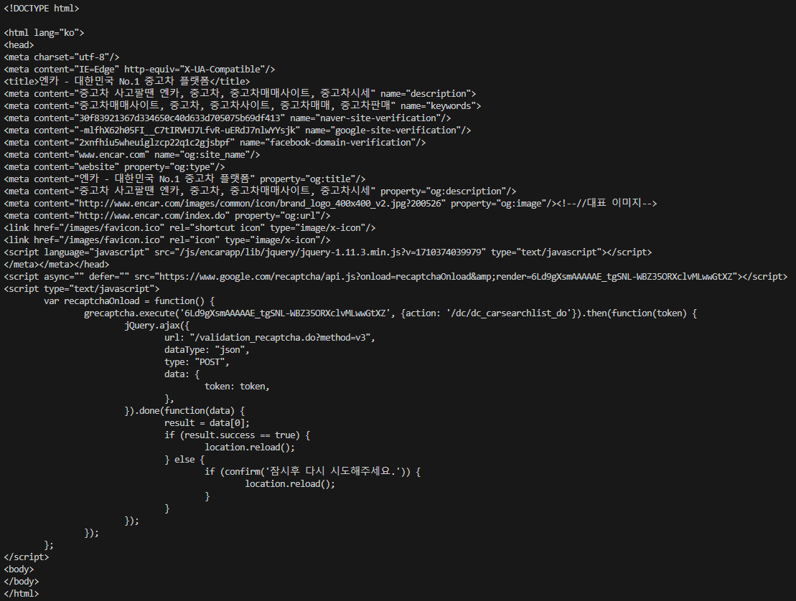
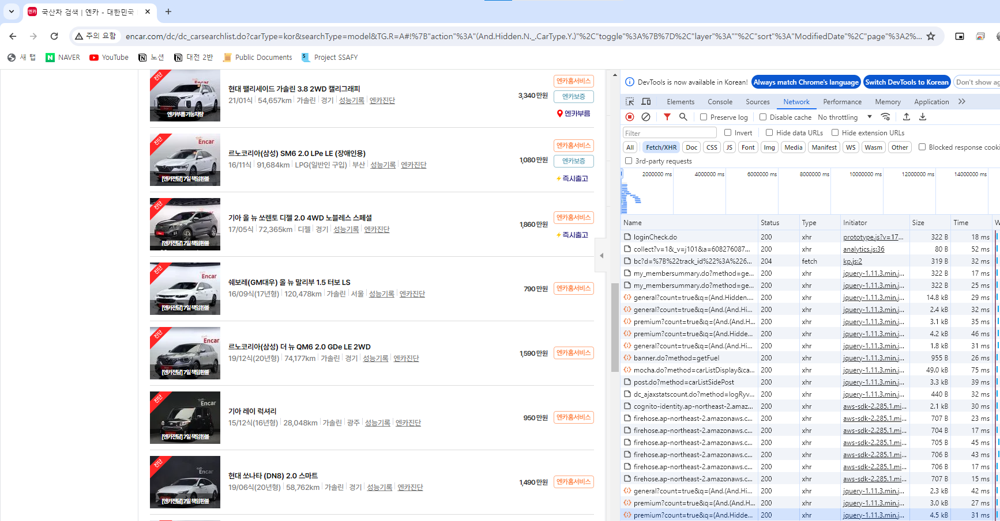
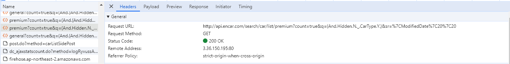
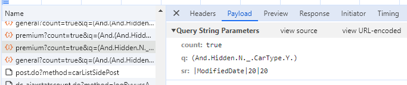

# Encar 웹 크롤링 간이 프로젝트
- 목적
  - Encar에서 차량 검색을 하려고 하니 일일이 링크를 타고 들어가서 검색해야함
  - 차량 내장은 옵션으로 보이지 않아서, 베이지색 내장이 적용돼 있는지 확인할 수 없음
  - 원하는 옵션을 검색하고, 판매 설명에 있는 데이터를 기준으로 "베이지","밝은 내장" 등의 키워드가 있는 url만 가져와서 설명과 함께 링크를 저장하고싶음
- 방법
  - 웹 스크래핑(웹 크롤링)을 해서 Django를 활용한 DB에 필요한 데이터를 저장해보자
- 사용 라이브러리
  - Django, BeautifulSoup
## 진행 순서
- 가상 환경 설정 (venv)
- 사용 라이브러리
  1. django
  2. beautifulsoup4
  3. requests
  - pip install로 패키지 다운로드 후. requirements.txt에 저장!
- project, app 생성
  - pjt : encar_scraping_pjt
  - app : encarscraper (생성 후 pjt의 settings에 바로 앱 저장)


## 학습 내용
### 웹 스크래핑 (Web Scraping)
- beatifulsoup4 패키지를 활용한 HTML parsing

### requests 라이브러리
- 파이썬에서 HTTP를 사용하기 위해 쓰이는 라이브러리
- 기본 내장 라이브러리는 아니지만, 거의 표준처럼 널리 쓰이고 있음
- requests.get(url)로 url의 html을 받아옴

### Selenium
- BeautifulSoup 라이브러리로는, **자바스크립트 또는 비동기적 AJAX 요청으로 동적으로 생성된 정보는 가져올 수 없다**
- 아래처럼 엔카 홈페이지의 정보는 대부분 AJAX 요청으로 생성됨
- 
- Selenium 라이브러리로는 실제 사용자가 행동하는 것처럼 웹 페이지에 접근이 가능
- Selenium 공식 문서를 기준으로 학습함
1. pip install selenium으로 라이브러리 다운로드
2. 사용할 브라우저의 드라이버 다운로드
  - 금번 프로젝트의 경우 Chrome을 사용하므로, 버전에 맞는 Chrome 드라이버를 다운로드함
3. view에 from selenium import webdriver 모듈 호출
4. driver.webdriver('{url(드라이버가 설치된 경로)}')로 드라이버 생성
5. driver.get('{url}')로 크롤링할 사이트를 호출
  - driver.quit()로 닫음
6. selenium으로 진행하려 했으나.. reCAPTCHA 해제 및 목록에 접근하는 단계가 복잡하고 느릴 것 같아서 다른 방법으로 진행함

### Fetch/XHR
- 크롬 개발자 도구로, 웹 페이지에서 어떤 방식으로 데이터를 불러오는지 확인할 수 있다.
- 엔카의 제품 목록은 XHR로 불러오는 것을 확인 (F12 -> Network -> Fetch/XHR -> Type 열)
- 
  - XHR이란? XMLHttpRequest(XHR)은 AJAX 요청을 생성하는 JavaScript API입니다. XHR을 메서드로 브라우저와 서버 간의 네트워크 요청을 전송할 수 있습니다.
  - 출처. mdn web docs (https://developer.mozilla.org/ko/docs/Glossary/XMLHttpRequest)
- 여기까지 엔카의 웹페이지는 xhr을 활용해서 AJAX 요청을 생성하여 서버에서 제품 목록을 불러오는 것을 확인
  - 나도 JavaScript로 요청해서. 제품 정보를 받아올 수 있을까? 
  - 받아오려면 어떻게 해야할까?

### XHR로 서버에 데이터 요청하기
1. Request URL을 확인
  - 임의로 아무 목록에 들어가서, Headers -> Request URL에서 요청 url을 확인
  - 
  - 엔카의 요청 url은 http://api.encar.com/search/car/list/premium
  - 파라미터로는 cont, q, sr 세 가지가 있는 것을 확인
  - Payloda 탭에서 Query String Parameters를 확인 가능
  - 
  - Response 탭에서 위 주소로 서버에 요청을 해서, 어떤 값을 반환받았는지 확인이 가능함

2. url로 요청을 보내보자
  - params 정보. 변수처리해도 되지만, 우선 첫 페이지만 불러오기 위해 임의로 값을 부여해준다.
  - count : true
  - q : (And.Hidden.N._.(C.CarType.Y._.(C.Manufacturer.**제조사**._.ModelGroup.**차종**.)))
  - sr : |ModifiedDate|**page*20**|20
  ```python
  import requests

  encar_url = 'http://api.encar.com/search/car/list/premium'

  param = {
          "count": "True",
          "q": "(And.Hidden.N._.CarType.Y.)",
          "sr": "|ModifiedDate|0|20"
      }

  response = requests.get(encar_url, params= param)
  print(response.text)
  ```
  - 위 코드로 요청을 보내면, <Response [407]>로 응답받는다.
  - mdn docs response 407을 검색해보니, 407 Proxy Authentication Required라는 제목의 문서로 안내해준다.
  - 컴퓨터로 서버에 요청을 보낼 때, browser > proxy server > server 순서로 요청이 들어가는데, 바로 서버에 요청을 보내니 프록시 인증이 요구된다. 라고 반환해 주는 것
  - 해결책 : requests.get 함수의 headers 매개변수를 사용해 요청에 HTTP 헤더를 포함한다.
  - User-Agent의 값은 구글에 "my user agent"를 검색해서 복사한다.
    ```python
    response = requests.get(encar_url, params= param, headers={"User-Agent": "Mozilla/5.0 (Windows NT 10.0; Win64; x64) AppleWebKit/537.36 (KHTML, like Gecko) Chrome/122.0.0.0 Safari/537.36"})
    ```
  - 잘 동작한다!